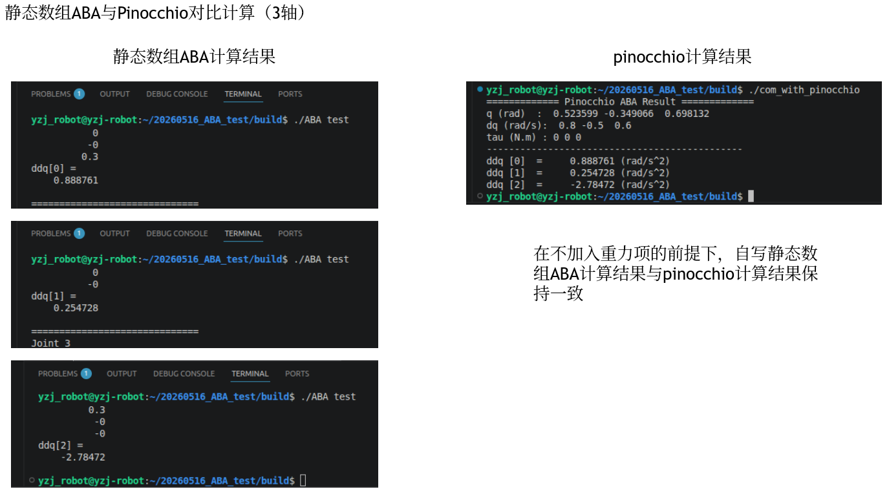
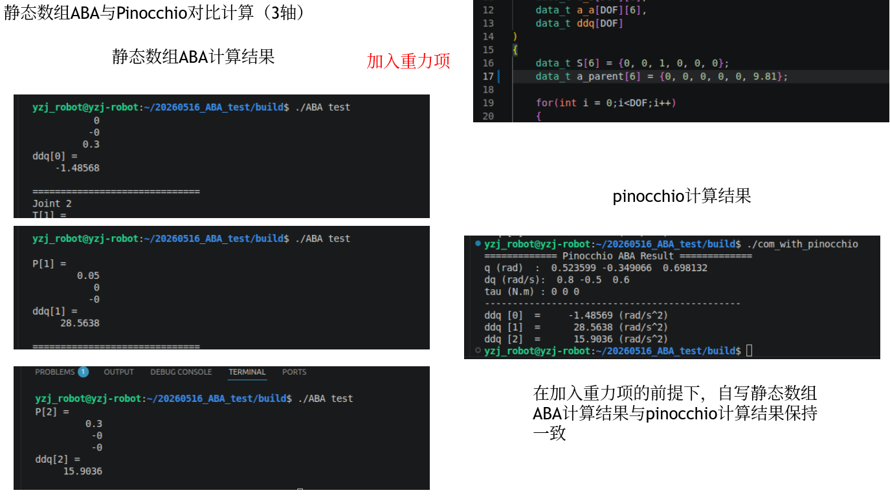
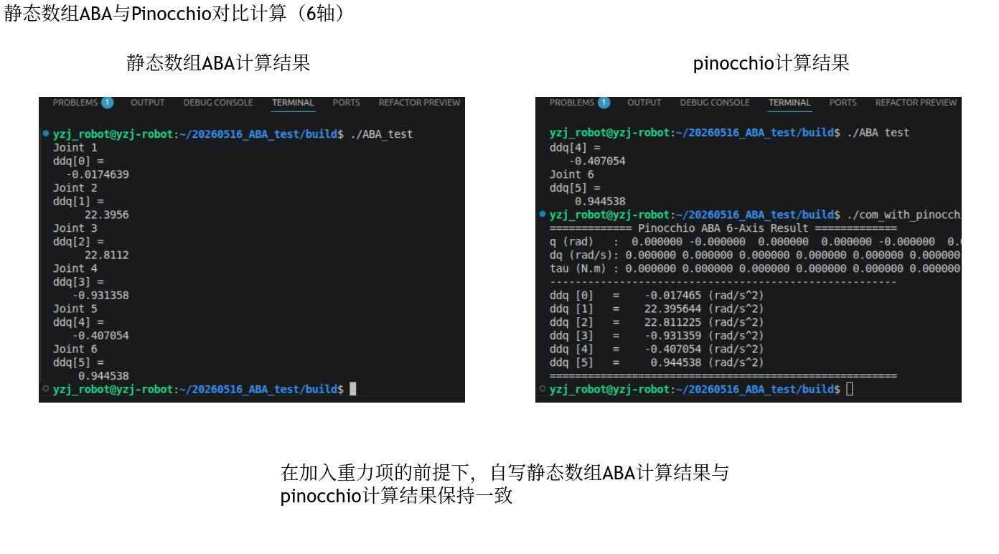

该代码用于静态数组C++实现ABA机器人正动力学算法，用于HLS综合与FPGA并行加速计算

test文件：测试代码文件夹，关节自由度DOF和数据类型在include/test_T_R_out.h中定义

    test/test_ABA.cpp：三轴机器人的ABA测试输出计算文件，目前计算结果为正确的计算结果

    test/test_T_R_out.cpp：用于根据DH表生成齐次变换矩阵、旋转矩阵、位移矩阵（测试文件）

    test/test_v_ori.cpp：用于实现速度的前向递推计算，主要根据为书本的Pass1部分的公式4

    test/test_c.cpp:用于实现xxxx计算，主要根据为书本的Pass1部分的公式5

    test/test_back.cpp：用于实现公式的pass2部分后向递推过程

    test/test_pass3.cpp：用于实现公式的pass3部分前向递推过程

    test/test_ABA_final.cpp：用于连接所有的子函数，通过静态数组ABA计算关节加速度

Com_with_pinocchio文件：计算结果对比文件夹

    Com_with_pinocchio/com_with_pinocchio.cpp：用pinocchio计算三轴机器人关节加速度，与自写ABA算法进行对比

notes文件：笔记文件夹

    ABA正动力学推导记录：对书本的ABA计算推导过程以及重要公式的关联代码进行记录
    

2026-05-22：计算结果比较，三轴机器人

2026-05-22:计算结果比较，六轴机器人
