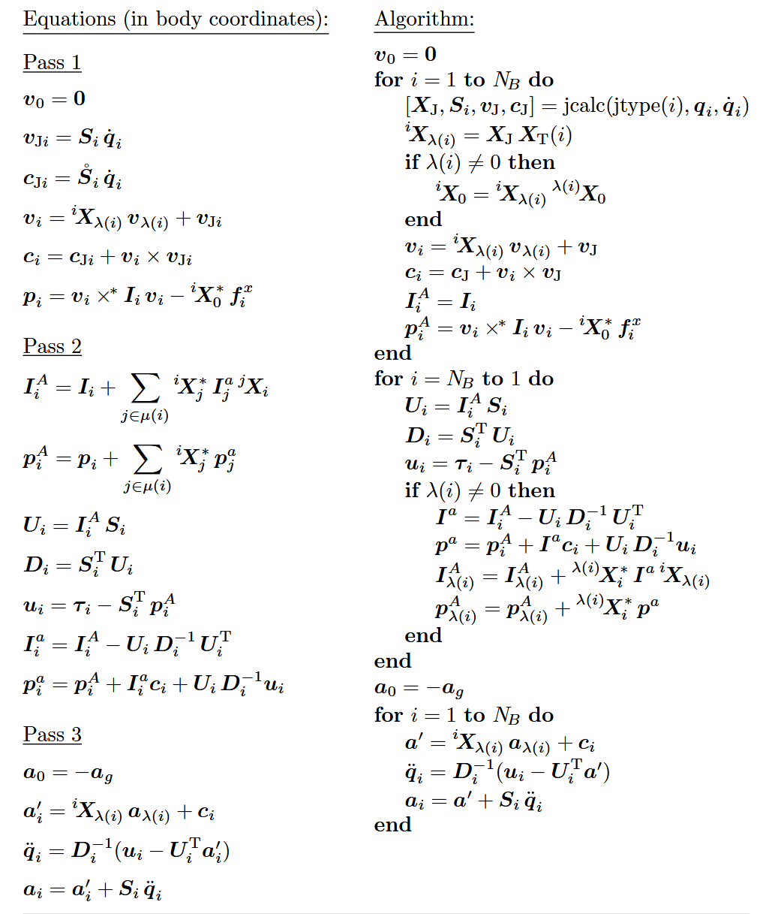
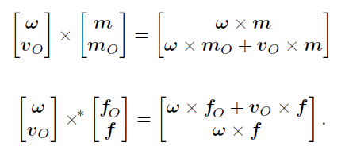

# ABA正动力学推导记录

## 主要原理

主要公式为P132页



## PASS1计算

关节轴变量：

对于一个转动关节，在它自己的局部坐标系下，关节轴通常写成：

$$
S_i=\begin{bmatrix}0\\
 0\\
 1\\
 0\\
 0\\
 0\\
\end{bmatrix}
$$

表示：绕着局部$z_i$ 轴转动

对于一个移动关节，在局部坐标系下通常写成：

$$
S_i=\begin{bmatrix}0\\
 0\\
 0\\
 0\\
 0\\
 1\\
\end{bmatrix}
$$

表示：沿着局部$z_i$ 轴移动

因此，对于用MDH方法进行建模的机器人，其局部坐标系都是：

$$
S_i=\begin{bmatrix}0\\
 0\\
 1\\
 0\\
 0\\
 0\\
\end{bmatrix}
$$

因此，例如关节一的速度$\dot{q}_1=0.8$ ，那么根据Pass1的公式2计算关节速度$v_{Ji}$ 为：

$$
v_{J1}=S_1\dot{q}_1=[0,0,0.8,0,0,0]^T
$$

### Pass1公式4

在公式中所有带$\lambda$ 的均与父节点有关

公式4为：

$$
v_i =  \ ^iX_{\lambda(i)}v_{\lambda(i)}+v_{Ji}
$$

计算连杆1的空间速度为：

$$
v_1 = X_{\lambda1}v_0+v_{J1}
$$

因此，${}^iX_{\lambda(i)}$ 的作用是将父节点的坐标系速度转移到子节点坐标系

#### ${}^iX_{\lambda(i)}$ 的计算

具体计算来源来自于书本的第22页General Transform章，在公式2.24介绍了具体的计算方式，另外还要参考本页的公式2.28，将公式2.28看作齐次变换矩阵，即：

$$
^0T_1 = \begin{bmatrix}
 ^0R_1 &^0 p_1\\
 0 &1
\end{bmatrix}
$$

其中，$p_1$ 为：

$$
p_1 = \begin{bmatrix}p_{1x}\\
 p_{1y}\\
 p_{1z}\\
\end{bmatrix}
$$

假设是计算$X_{\lambda1}$ ，为6*6矩阵

$$
X_{\lambda1} = \ ^1X_0=\begin{bmatrix}
 R_1^T &0 \\
- R_1^T[p_1]_{\times}  & R_1^T
\end{bmatrix}
$$

#### 叉乘计算定义

详见书本第21页公式2.23：

$$
\begin{bmatrix}x\\
 y\\
 z\\
\end{bmatrix}\times =\begin{bmatrix}
 0 & -z & y\\
z  & 0 & -x\\
 -y &x  &0
\end{bmatrix}
$$

相当于定义了叉乘的矩阵乘法形式，也就是：

$$
[a]_{\times }b = a\times b
$$

等式左边为矩阵相乘，等式右边为叉乘

因此，将$[a]_{\times}$ 定义为叉乘矩阵，也叫做反对称矩阵

### Pass1公式5

因为为普通转动副，局部的$S_i$ 不随时间而变换，因此$\overset{\circ}{S}_i$ 为0，因此此时公式5可以简化为，其中c为**速度积加速度**：

$$
c_i = v_i\times v_{Ji}
$$

为什么后面两个为叉乘形式，而不是叉乘矩阵，因此这里的两个$v$ 向量均为空间向量，即两个向量均为6*1的向量

#### 空间向量叉乘

计算公式可见书本p21页，公式2.33与公式2.34

空间速度向量在本书中，统一采用先角速度，后线速度的形式，即：

$$
v=\begin{bmatrix}\omega_x\\
 \omega_y\\
 \omega_z\\
 v_x\\
 v_y\\
 v_z\\
\end{bmatrix}=\begin{bmatrix}\omega\\
 v_o\\
\end{bmatrix}
$$

空间向量叉乘的计算方式为：



### Pass1公式6

该公式用来计算刚体偏置力$p_i$ ，其中，所用到的空间叉乘符号为$\times ^*$ ，因此要先计算后面的矩阵相乘（$I_iv_i$ ），另外在不考虑外力的情况下，$f_i^x=0$

其中，空间惯量与空间速度相乘，得到空间动量，相关内容在书本P32页，公式2.61

#### 空间惯量

在书本的P32到P33页，描述了质心处的空间惯量与一般原点O处的空间惯量

其中，质心处的空间惯量为公式2.62

$$
I_C=\begin{bmatrix}
 \bar{I}_C  & 0\\
  0&m1
\end{bmatrix}
$$

一般原点O处的空间惯量为公式2.63：

$$
I_O=\begin{bmatrix}
  \bar{I}_C +mc_{\times}c_{\times}^T& mc_{\times}\\
   mc_{\times}^T&m1
\end{bmatrix}
$$

其中，矩阵右下角为质量对角矩阵，即如果当前连杆质量为0.5，该矩阵为：

$$
m1=\begin{bmatrix}
0.5  & 0 & 0\\
0  & 0.5 & 0\\
0  & 0 &0.5
\end{bmatrix}
$$

假设第一根连杆参数为：

质量：

$$
m_1=2.916kg
$$

质心位置：

$$
c_1=\begin{bmatrix}0\\
 0\\
 -0.15\\
\end{bmatrix}
$$

因此，最后算出的$[c]_{\times}$ 就是上面的叉乘矩阵，为3 * 3矩阵，$m$ 为质量，为1 * 1

惯量：

$$
\bar{I}_{C1}=\begin{bmatrix}
  0.022745& 0 &0 \\
  0& 0.022745 & 0\\
 0 &0  &0.00175
\end{bmatrix} 
$$

最终的空间惯量矩阵为6*6矩阵

#### 空间动量

$$
 h_i= I_iv_i
$$

空间动量为6*1矩阵

在计算空间动量矩阵后，就可以计算$p_i$ 矩阵，为6*1矩阵

$$
p_i=v_i\times^*h_i
$$

空间叉乘符号为$\times^*$ ，计算公式可见书本p21页，公式2.33与公式2.34

## PASS2计算

该过程公式需要从末端开始计算，假设为3连杆机器人，需要从第三个连杆开始计算，然后计算第二个连杆，最后计算第一个连杆

各个物理量含义为：

$I_i^A$ ：铰接体惯性矩阵

$p_i^A$ ：铰接体偏置力

$I_i^a$ ：传递给父节点的等效惯性

$p_i^a$ ：传递给父节点的等效偏置力

### 末端连杆

对于末端连杆，因为末端连杆没有子节点，因此：

$$
I_{DOF}^A=I_{DOF}
$$

$$
p_{DOF}^A=p_{DOF}
$$

其中，公式里面的$I$ 为空间惯量，6*6矩阵

$$
U_{DOF} = I_{DOF}^AS_{i}
$$

其中，

$$
S_i=\begin{bmatrix}0\\
 0\\
 1\\
 0\\
 0\\
 0\\
\end{bmatrix}
$$

因此，$U_i$ 就是6*6矩阵$I_i^A$ 的第三列

下一个公式为：

$$
D_{DOF}=S_i^TU_{DOF}
$$

因此，$D_i$ 就是6*1矩阵$U_i$ 的第三行

公式5比较简单，不再描述，对于公式6，中间的$D_i^{-1}$ ，因为$D_i$ 为一个数字，因此有：

$$
D_i^{-1}=\frac{1}{D_i} 
$$

也是一个数字，因此这个计算最终为一个6*6矩阵

最后，公式7的公式计算方法也很容易得到

### 其余连杆

假设目前为三连杆机器人，需要将连杆3的贡献传递给连杆2，经过上面的公式，连杆3的部分已经计算得到，对于连杆2，只有公式1和公式2的计算有所不同：

对于连杆2：

$$
I_2^A=I_2+X_{\lambda3}^TI_3^aX_{\lambda3}
$$

$$
p_2^A=p_2+X_{\lambda3}^Tp_3^a
$$

其中，$X_{\lambda3}$与pass1公式部分为同一个量

对于连杆1：

$$
I_1^A=I_1+X_{\lambda2}^TI_2^aX_{\lambda2}
$$

$$
p_1^A=p_1+X_{\lambda2}^Tp_2^a
$$

### 累加问题

可以看到在计算$I_i^A$ 和$p_i^A$ 时，需要用到累加：

$$
\sum_{j\in \mu (i)}^{} 
$$

其中：

$$
\mu (i)=连杆i的直接子连杆集合
$$

也就是说：

| 连杆$i$ | 直接子连杆$\mu(i)$ |
| :-----: | :----------------: |
|    1    |        {2}         |
|    2    |        {3}         |
|    3    |         无         |

## PASS3计算

公式1为在基座是否加入重力项，这里给出代码：

```C++
data_t a_parent[6] = {0, 0, 0, 0, 0, 9.81};
```

公式2为计算连杆偏置空间加速度

其中，$X_{\lambda3}$ 与pass1公式部分为同一个量，$a_{\lambda(i)}$ 就是$a_i$ ，计算出来为6*1矩阵

公式3为关节加速度

其中，因为$D_i$ 为一个数字，因此有：

$$
D_i^{-1}=\frac{1}{D_i} 
$$

也是一个数字

公式4为连杆空间加速度，正常按照公式计算即可